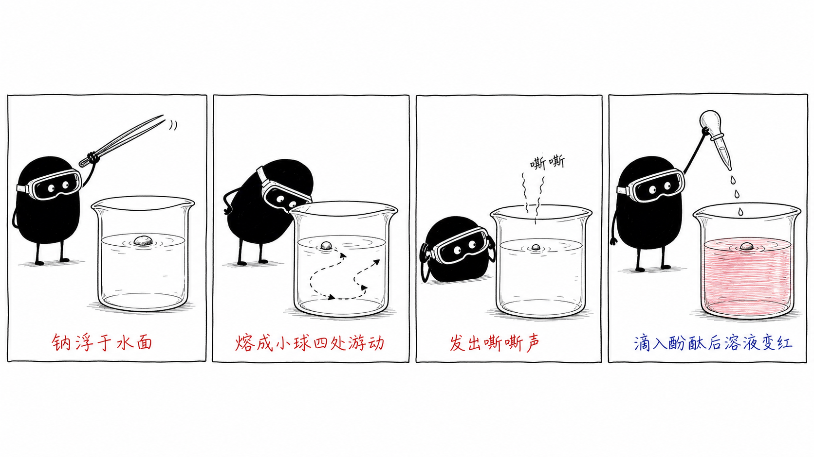
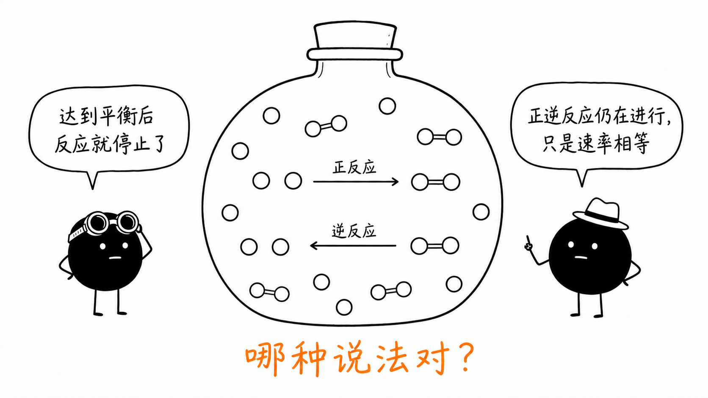
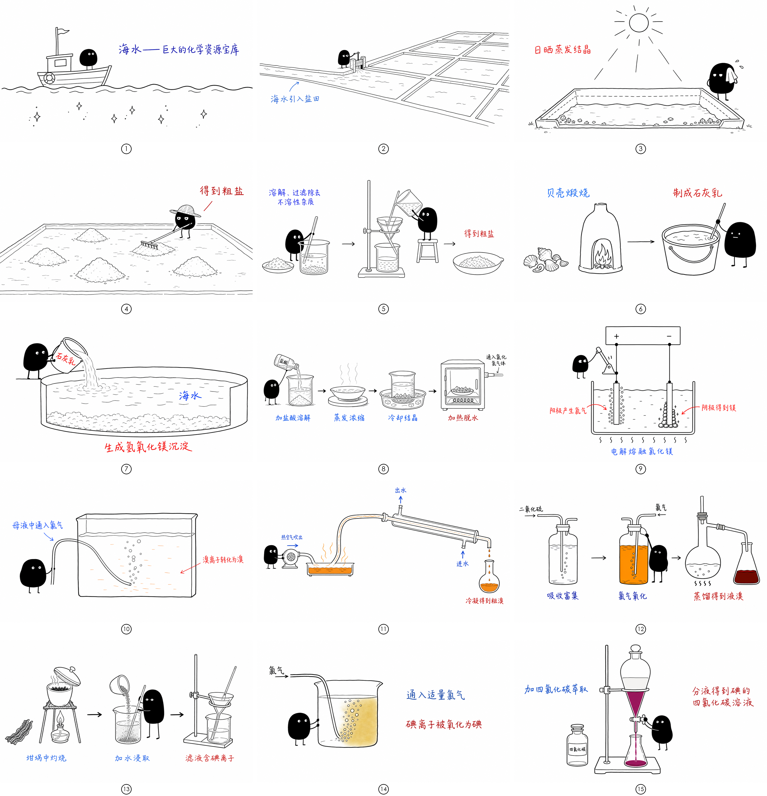
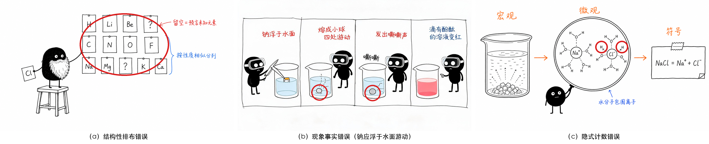

# ai-chem-illustrations · AI 文生图 × 高中化学教学插图

用一套**可复制的提示词模板 + 化学专用质检清单**，让不会画画的化学教师也能稳定产出风格统一、科学准确的教学插图。不需要编程，不绑定任何特定 AI 工具。

配套论文：《AI文生图辅助高中化学教学插图创作的实践研究》（投稿中）。本仓库即论文所述"配套模板与开源资源"。

**🔧 在线提示词装配器：<https://8848t.github.io/ai-chem-illustrations/assembler/>**（无需下载，打开即用；也可下载 `assembler/index.html` 双击离线使用）

## 三步上手

1. **填模板**：打开[在线装配器](https://8848t.github.io/ai-chem-illustrations/assembler/)填空，或直接复制 [`prompts/模板.md`](prompts/模板.md) 手动填写；
2. **发给 AI**：整段复制进任何支持文生图的对话式 AI（GPT 系列、豆包、即梦等）——装配器也支持配置 API 后一键生成；
3. **人工质检**：对照 [`checklist/质检清单.md`](checklist/质检清单.md) 逐项核验——中文逐字校对、微粒逐个清点、位置关系核对——不合格则按 [`prompts/局部编辑指令.md`](prompts/局部编辑指令.md) 迭代。**AI 生成的图片是需要教师加工的原材料，未经质检不得直接用于教学。**

## 样图速览

以下均由本仓库模板生成（完整提示词见 [`prompts/样图提示词档案.md`](prompts/样图提示词档案.md)）。

### 实验现象漫画 · 钠与水反应

📋 查看本图提示词

> 生成一张独立的 16:9 横版中文高中化学教学插图。【风格】纯白背景；极简黑色手绘线稿，笔线轻微抖动；大量留白；标注只用红色。禁止：渐变、阴影、商业矢量风、PPT 信息图、幼稚儿童插画；不写标题。【角色】小黑，道具：护目镜（每格佩戴）；四格中体型大小保持一致，任何一格都不接触烧杯。【主题】钠与水反应的实验现象。【结构】四格分镜：第1格，定格于钠已浮在水面的瞬间——银色小钠块浮于烧杯水面上，小黑手持实验室长镊子刚从杯口上方移开，标注"钠浮于水面"；第2格，钠熔成闪亮小球沿水面游动，在水面线上画虚线曲折轨迹并带小箭头，小黑伸头凑近注视但与烧杯保持距离，标注"熔成小球四处游动"；第3格，水面上的小球明显比第2格变小，旁有"嘶嘶"声符，小黑侧头贴近烧杯、一只手拢在头侧作倾听状，标注"发出嘶嘶声"；第4格，小黑站在烧杯旁指向烧杯，杯内溶液变粉红，标注"滴入酚酞后溶液变红"。【标注】四格标注全部红色、字号一致、底部对齐；只允许：钠浮于水面／熔成小球四处游动／发出嘶嘶声／滴入酚酞后溶液变红／嘶嘶。【约束】化学准确性最高优先；钠浮于水面绝不下沉；第3格小球明显小于第2格；四格边框四边完整闭合；任何一格不出现火焰；留白至少 30%。

### 迷思概念漫画 · 平衡后反应停止了吗

📋 查看本图提示词

> 生成一张独立的 16:9 横版中文高中化学教学插图。【风格】通用风格，仅两处对话气泡、两个箭头标签与底部提问有文字。【角色】两个小黑分立两侧，以不同道具区分：左侧戴护目镜、右侧戴小帽。【主题】可逆反应达到平衡后反应是否停止的概念辨析。【结构】中央画一只带塞的密闭容器，容器内用两类微粒表现正在发生的双向反应：单个空心圆（反应物分子）与两圆相连的哑铃形分子（生成物分子）……上行：两个单圆＋向右箭头（标"正反应"）＋一个双圆分子；下行：一个双圆分子＋向左箭头（标"逆反应"）＋两个单圆。两支箭头长度、粗细完全相同。左侧角色气泡"达到平衡后反应就停止了"，右侧角色气泡"正逆反应仍在进行，只是速率相等"，画面下缘橙色手写"哪种说法对？"。【约束】逆反应必须是拆分方向；两支箭头完全等长等粗；留白充分。

### 单元系列插图 · 海洋化学资源的综合利用（15格）

固定角色与统一风格使单图可扩展为整套单元资源：晒盐精制①~⑤ / 提镁⑥~⑨ / 提溴⑩~⑫ / 海带提碘⑬~⑮。十五格逐格提示词见[档案](prompts/样图提示词档案.md)。

### 为什么必须人工质检 · 三类典型错误

左：元素符号全对、排布却不合周期律；中：标注写"四处游动"、钠球却沉在杯底；右：水合离子旁多出两个孤立氢原子（AI 辅助校对曾漏检，教师人工复核才发现）。——**这就是质检清单存在的意义。**

## 目录

| 路径 | 内容 |
|---|---|
| [`prompts/模板.md`](prompts/模板.md) | 提示词模板全文（五要素 + 显式化三件套 + 实操提示） |
| [`prompts/样图提示词档案.md`](prompts/样图提示词档案.md) | 全部样图的完整中文提示词 + 跨工具复测记录 |
| [`prompts/局部编辑指令.md`](prompts/局部编辑指令.md) | 单处修错的局部编辑指令与常见迭代对策 |
| [`checklist/质检清单.md`](checklist/质检清单.md) | 12 项化学专用质检清单 + 五类典型错误 |
| [`examples/成图/`](examples/成图/) | 论文样图成品（12 张） |
| [`examples/迭代案例/`](examples/迭代案例/) | "错误版 → 修正版"真实对照 |
| [在线装配器](https://8848t.github.io/ai-chem-illustrations/assembler/) ／ [`assembler/index.html`](assembler/index.html) | 提示词装配器：单文件、零安装、离线可用、支持自定义 API 直连 |
| [`docs/使用指南.md`](docs/使用指南.md) | 五步操作流程、图片类型分流建议、跨工具使用说明 |

## 适用与不适用

**适合文生图**：实验现象漫画、迷思概念漫画（concept cartoon）、化学史场景、生活情境图、显式计数的简单微粒示意图、科普海报与连载。

**不宜文生图**（请改用代码绘图 / 结构式编辑器 / 传统绘图）：精确实验装置图、坐标曲线与数据图表、复杂结构式与环系有机分子、元素周期表等有严格排布约束的图、考试命题用图。

## 角色 IP

样图中的固定角色"小黑"（小型全黑实心怪物、白色圆点眼、细腿、表情呆滞认真）经原作者授权使用。模板中的角色为可替换槽位——建议各校教师定义自己的班本角色，方法框架不受影响。

## 免责声明

- 文生图模型存在系统性错误（空间关系、数量、隐含结构约束等），本仓库的质检清单正为此而设；一切生成图片须经教师人工终审后方可用于教学；
- 生成图片的版权归属依所用 AI 平台条款与当地法规而定，公开出版前请自行核对目标出版方政策；
- 在装配器中配置的 API Key 仅保存在使用者本机浏览器，页面无后端、不收集任何数据。

## 贡献

欢迎教师提交经过验证的提示词卡片（知识点 + 提示词 + 成图 + 质检记录）到 `prompts/`，共建教研提示词库。

## License

[MIT](LICENSE)
